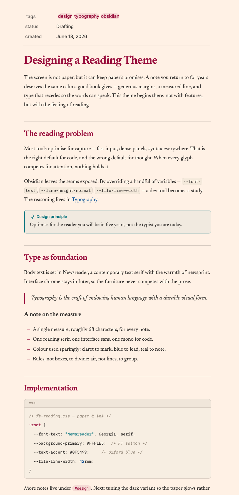
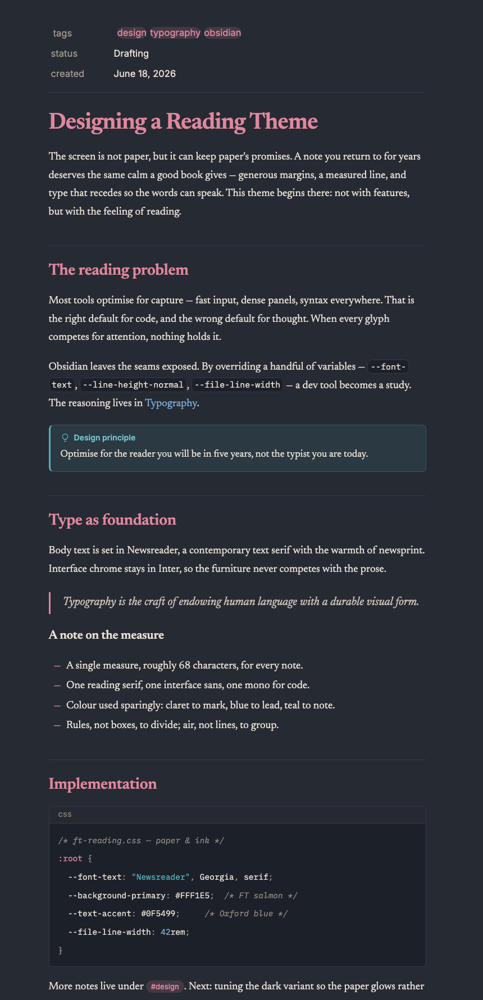

# FT Reading

A warm, editorial Obsidian theme inspired by the Financial Times — serif body
text, salmon paper, and a calm reading measure. Built for long-form reading
and writing: a constrained line width, thin rules instead of boxes, and color
used sparingly (claret to mark, Oxford blue to lead, teal to note).

| Light | Dark |
|---|---|
|  |  |

## Features

- **Editorial typography** — body and headings in Newsreader, interface chrome
  in Inter, code in IBM Plex Mono. All three are bundled into the theme as
  data URIs, so it works fully offline.
- **FT palette, both modes** — salmon newsprint (`#FFF1E5`) in light mode; a
  warm slate (`#262A33`), never pure black, in dark mode. Claret headings,
  Oxford-blue links, teal callouts.
- **A reading measure** — ~68 characters per line, generous leading, thin
  hairline rules above sections.
- **Live Preview / Reading view parity** — headings, section rules, em-dash
  list markers, callouts, and syntax highlighting render the same in both
  editing modes.
- **Warm, low-contrast syntax highlighting** — one palette shared by reading
  view (Prism) and the editor (CodeMirror), with an uppercase language label
  on fenced code blocks.
- **Styled callouts, properties, and command palette** — tinted callout
  panels with a 3px accent spine, claret tag pills, and claret selection in
  the palette and quick switcher.

## Installation

### Manual

1. Copy `theme.css` and `manifest.json` into
   `<your vault>/.obsidian/themes/FT Reading/` (create the folder).
2. In Obsidian: **Settings → Appearance → Themes**, select **FT Reading**.

### Optional: FT-style drop cap

A drop cap on the first paragraph of each note ships disabled. To enable it,
uncomment the block at the bottom of the theme CSS (search for "drop cap").

## Development

`theme.css` is generated — the readable source is `theme-source.css`, which
contains every design token and rule without the embedded font payload. The
final file is produced by inlining the `fonts/*.woff2` files as base64
`@font-face` blocks at the `/* @FT-FONTS@ */` marker.

To iterate on the theme, edit the copy in your vault (or symlink it) and
reload with `Cmd/Ctrl+P → "Reload app without saving"`.

## Fonts

This theme embeds the following typefaces, each licensed under the
[SIL Open Font License 1.1](https://openfontlicense.org). They are free
substitutes for the Financial Times' proprietary Financier and Metric:

- [Newsreader](https://github.com/productiontype/Newsreader) © Production Type
- [Inter](https://github.com/rsms/inter) © Rasmus Andersson
- [IBM Plex Mono](https://github.com/IBM/plex) © IBM

## License

The theme's CSS is released under the [MIT License](LICENSE). The embedded
fonts remain under their own SIL OFL 1.1 licenses (see above).

FT Reading is an independent project inspired by the Financial Times' visual
language. It is not affiliated with or endorsed by the Financial Times.
